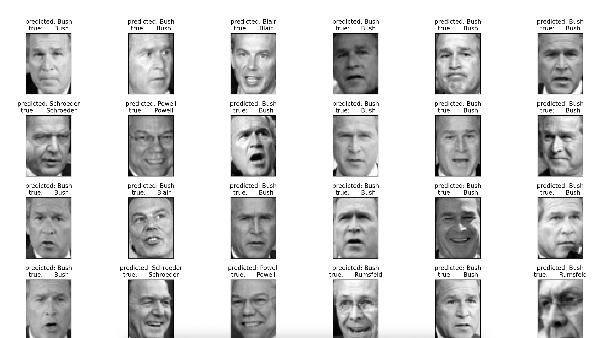
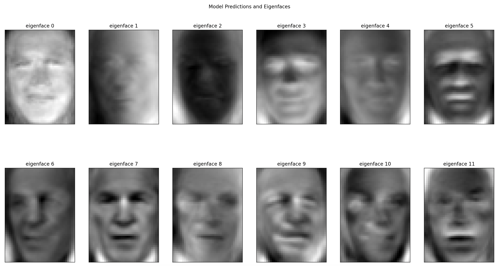

Eigenfaces: A Facial Recognition System with PCA

This project is a complete, end-to-end facial recognition system built in Python. It uses the classic "Eigenfaces" method, which is based on Principal Component Analysis (PCA), to perform dimensionality reduction and feature extraction.



The goal of this project is to demonstrate an understanding of the mathematical principles behind computer vision. This system uses linear algebra to identify the fundamental components of facial structures.

The pipeline includes:
1. Loading and preprocessing the "Labeled Faces in the Wild" dataset.
2. Splitting the data into training and testing sets.
3. Applying Principal Component Analysis (PCA) to extract the most important features ("eigenfaces").
4. Training a Support Vector Machine (SVM) classifier on these extracted features.
5. Evaluating the model's performance using a classification report and confusion matrix.

PCA & Eigenfaces

Principal Component Analysis is a dimensionality reduction technique used to transform a large set of variables into a smaller set that still contains most of the information. In the context of faces, PCA finds the "principal components," which are the directions of maximum variance in the data. These components, when reshaped as images, are known as Eigenfaces.



Each face in the dataset can then be represented as a weighted combination of these eigenfaces. This dramatically reduces the number of features required to describe a face (e.g., from 1850 pixels down to 150 component weights), making the classification task much more efficient.

How to Run This Project

    Clone the repository:

    git clone [https://github.com/YOUR_USERNAME/facial-recognition-with-pca.git](https://github.com/YOUR_USERNAME/facial-recognition-with-pca.git)
    cd facial-recognition-with-pca

    Set up a virtual environment and install dependencies:

    # Create and activate the environment
    python3 -m venv venv
    source venv/bin/activate 

    # Install the required packages
    pip install -r requirements.txt

    Run the main script:

    python facial_recognition_main.py

Results & Analysis

The model was trained and evaluated, achieving an overall f1-score of [0.85]. The detailed performance metrics are shown below:

Classification Report:
```
                   precision    recall  f1-score   support

     Ariel Sharon       0.88      0.54      0.67        13
     Colin Powell       0.80      0.88      0.84        60
  Donald Rumsfeld       0.82      0.67      0.73        27
    George W Bush       0.84      0.97      0.90       146
Gerhard Schroeder       0.91      0.80      0.85        25
      Hugo Chavez       1.00      0.47      0.64        15
       Tony Blair       0.97      0.78      0.86        36

         accuracy                           0.85       322
        macro avg       0.89      0.73      0.78       322
     weighted avg       0.86      0.85      0.84       322
```
Confusion Matrix:
The confusion matrix reveals where the model performs well and where it makes mistakes. The strong diagonal indicates a high number of correct predictions for most individuals.

```
[[  7   1   0   5   0   0   0]
 [  1  53   2   4   0   0   0]
 [  0   2  18   7   0   0   0]
 [  0   5   0 141   0   0   0]
 [  0   1   0   3  20   0   1]
 [  0   3   0   4   1   7   0]
 [  0   1   2   4   1   0  28]]
```

Technologies Used:

    Python

    Scikit-learn

    NumPy

    Matplotlib
